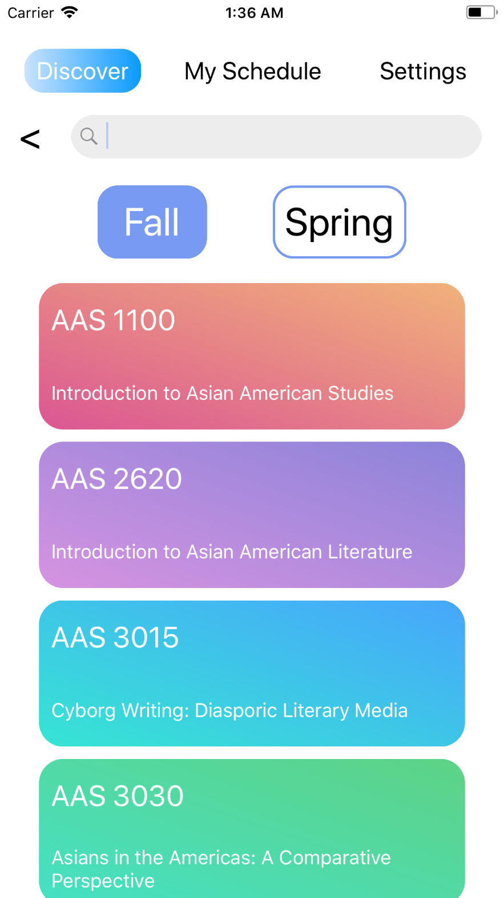
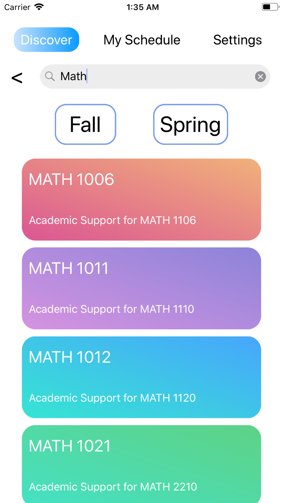
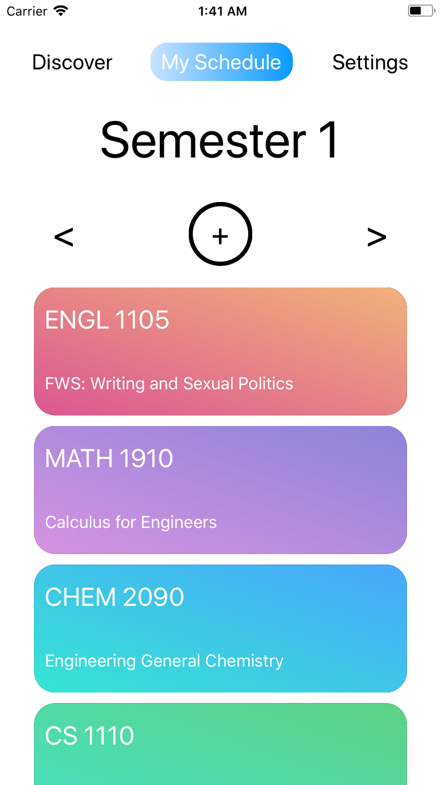
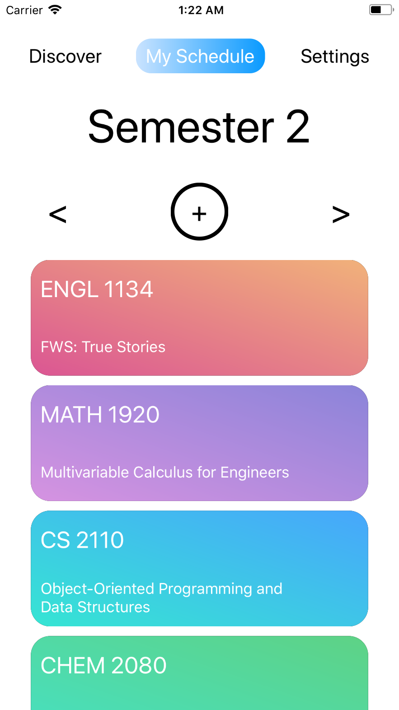
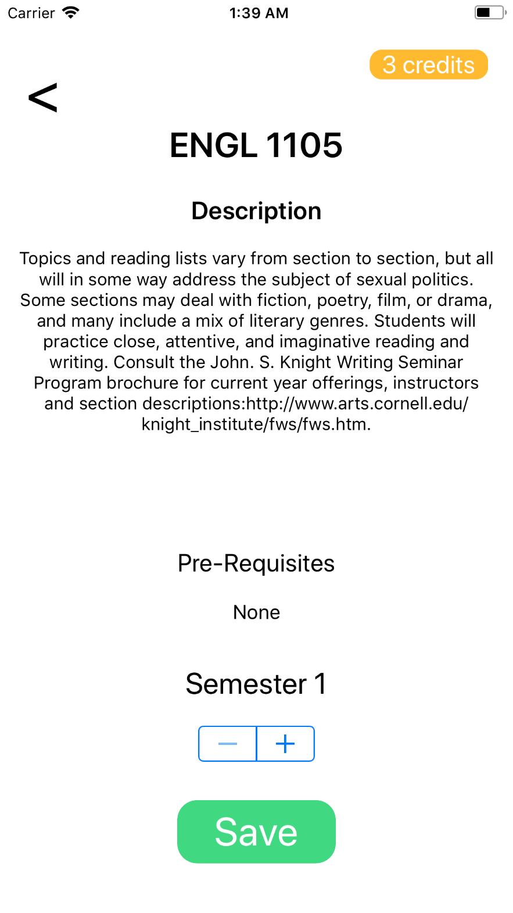

Created by: Omar Rasheed and Conner Swenberg, Desgined by: Eric Kim

4-Year-Planner: A simple guide to planning your undergraduate career at Cornell

4YearPlanner seeks out to assist Cornell undergraduates plan their class loads for their 4 years at Cornell.  
Through accessing Cornell's courses API, we draw information from all classes available in the fall and spring.
A user has the ability to choose a college, major, and minor (optional) through our Discover view, which then directs
the user to choose courses to add to their schedule.  Users also have the ability to view their 4 year course load
along with the ability to remove any courses simply from their schedule or use the add function to add more courses.

4YearPlanner does not yet accomplish all of our envisioned capabilities which include automatic alerts to notify a 
user that they do not yet fulfill their major requirements, they are missing prerequisites for classes / taking classes
out of order, and be able to recommend courses that will satisfy said corrections through the Discover view.

4YearPlanner also has a colorful, simple, and intuitive interface to enhance the user experience.  Other characteristics
such as rounded edges and color gradients also make the app pleasing to the eye.

All in all 4YearPlanner completes its goal of providing users with a simple and intuitive interface to create a four year schedule 
of courses to make planning ahead easier for Cornell's undergraduate population.

Link to Backend Repo: https://github.com/Omarrasheed/4YearPlannerBackend

URL for running server: http://35.190.187.113/planner/courses

IOS: Multiple ViewControllers with Navigation throughout the app to take you through the different pages; Various CollectionViews to present information on different pages; Queried from our database/API that we created 

Backend: Deployed our app on AWS EC2.

## Choose College, Major, and Minor:

## Filtering Courses by Term:

## Searching by name:

## Semester Info stored:
    

## DetailView for a Course:

